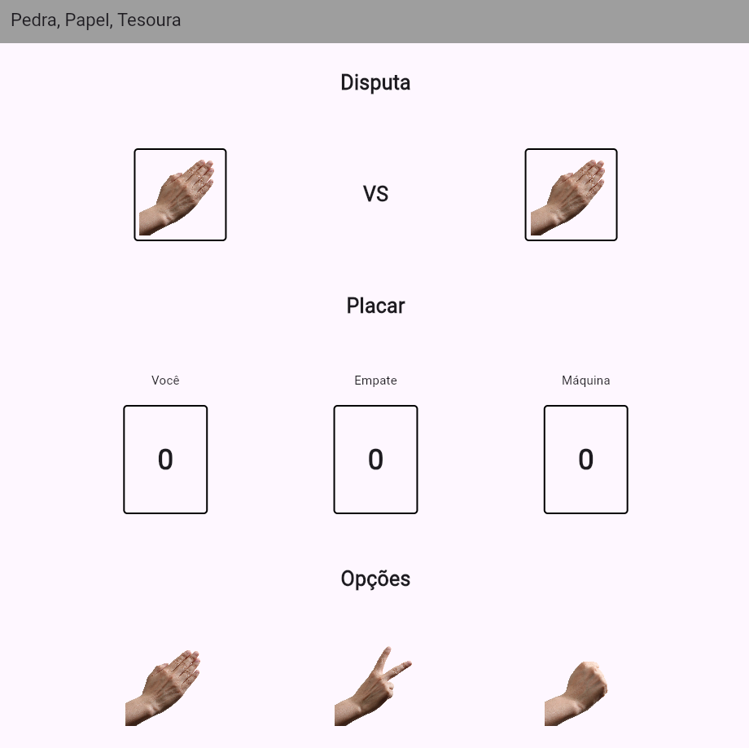
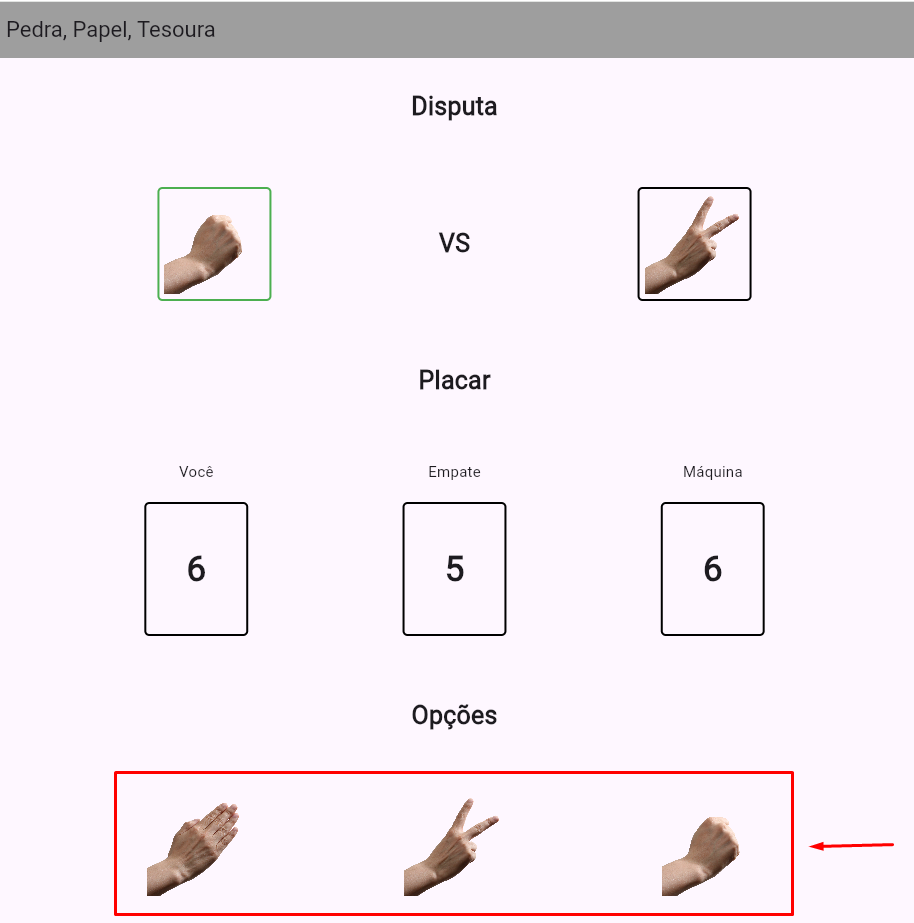
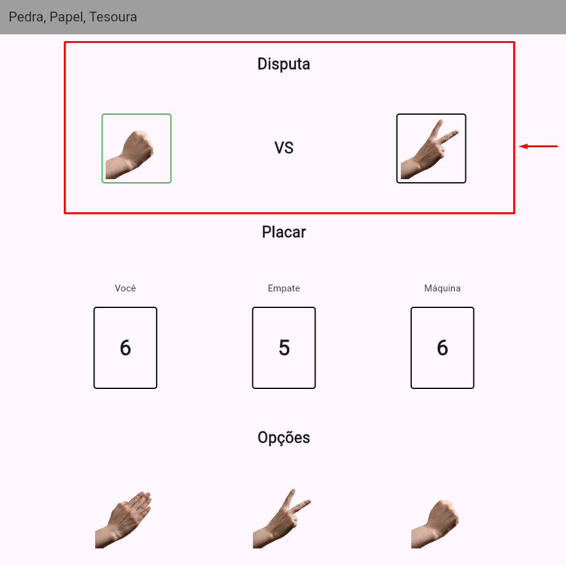
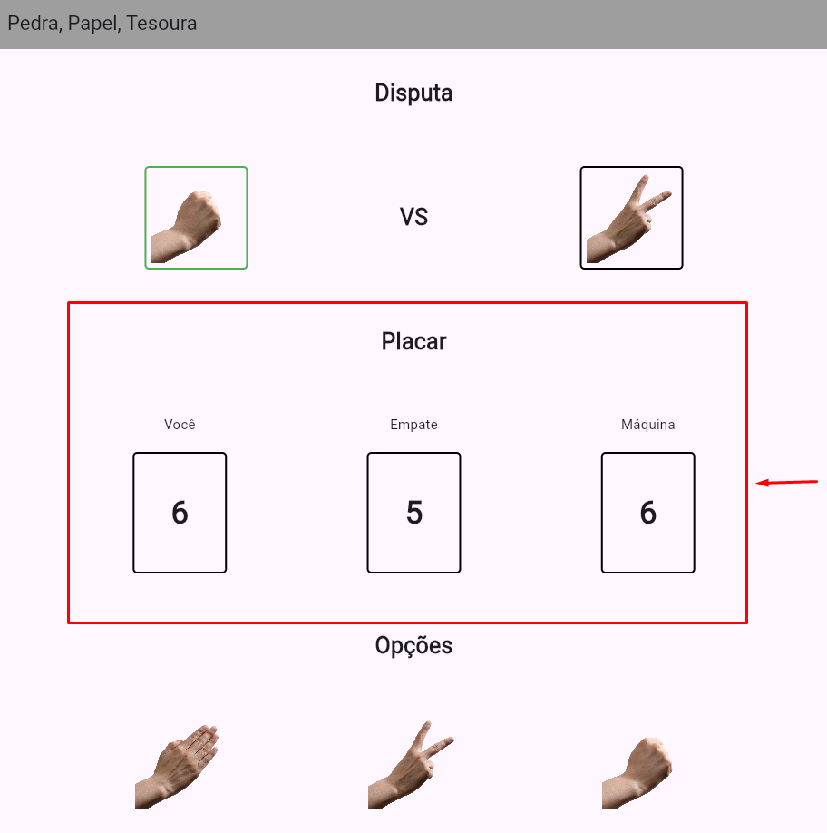

# 📌 Aplicativo Jokenpo 石📄✂️

> Este é um simples e divertido aplicativo mobile de Jokenpô (Pedra, Papel e Tesoura), onde você joga contra a "máquina". Teste sua sorte neste jogo clássico!

---

# 🎮 Como funciona?
Escolha entre Pedra 石, Papel 📄 ou Tesoura ✂️.

A máquina faz sua escolha aleatoriamente.

O vencedor é determinado pelas regras clássicas:

- Pedra vence Tesoura.

- Tesoura vence Papel.

- Papel vence Pedra.

Veja o resultado e tente vencer a máquina quantas vezes quiser!

---

## 👥 Desenvolvedores

| Nome | Matrícula |
|------------|--------------|
| Eduardo Evaristo | 123100051 |
| Rafael Miranda | 123100009 |

---

# 🖼️ Capturas de Tela

## Interface de Usuário  
O aplicativo possui uma interface simples e intuitiva, permitindo que o usuário em uma única tela consiga visualizar a jogada da partida anterior, pontuação e as opções de jogada.

  

---

## Selecionando a jogada  
Na parte inferior possui o menu de opções onde o jogador escolhe qual será sua jogada, para isto, basta clicar em uma das três imagens.  

  

---

## Feedback da jogada  
Na parte superior está o menu de disputa, onde é possível visualizar a jogada do usuário e do adversário. O ícone da jogada vencedora da rodada, ficará demarcada com as bordas na cor verde.  

  

---

## Placar  
Na parte central possui o placar que consta a pontuação individual dos jogadores e quantidade de empates.  

  

---

📌 *Projeto desenvolvido para colocar em prática o aprendizado de desenvolvimento em ambiente mobile.
